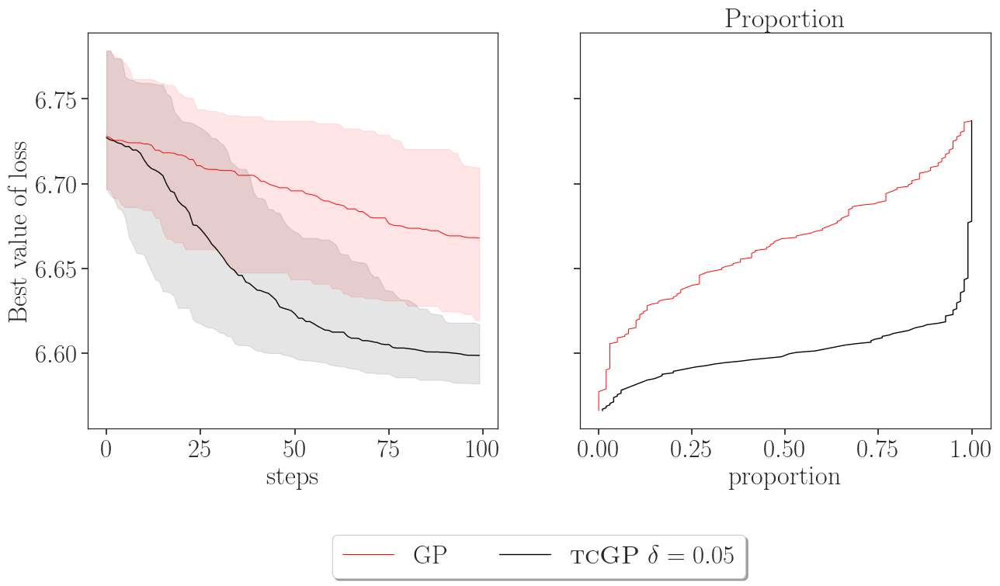

# ishigami_likelihood

ishigami_covparam_optim
This repository provides additional experimental results for the paper \emph{``Goal-Oriented Lower-Tail Calibration of Gaussian Processes for Bayesian Optimization''}.

Specifically, we consider covariance hyperparameter optimization for the Ishigami function augmented with two additional input dimensions, yielding a total input dimension of d = 6. The optimized covariance hyperparameters include the output scale and the lengthscales. We compare the performance of \texttt{tcGP} and \texttt{GP}.

The reported figure summarizes results over 100 independent repetitions. In each repetition, a new design of experiments is sampled, evaluated on the Ishigami function, and used to construct the likelihood, and hence the corresponding objective function.

